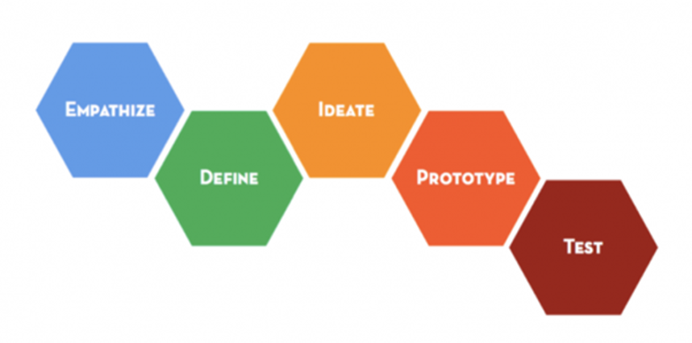
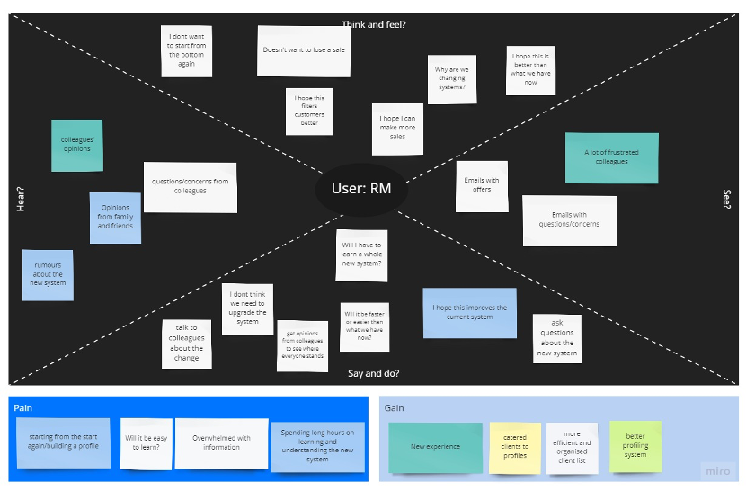
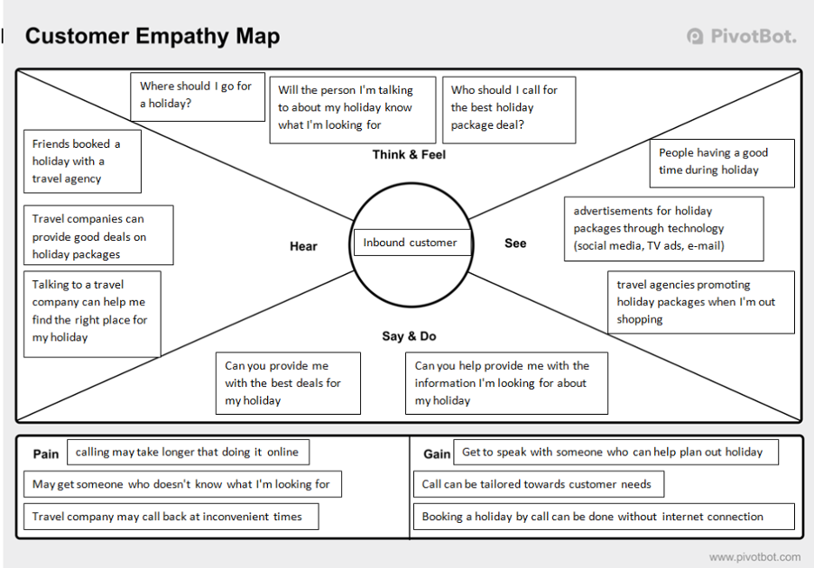
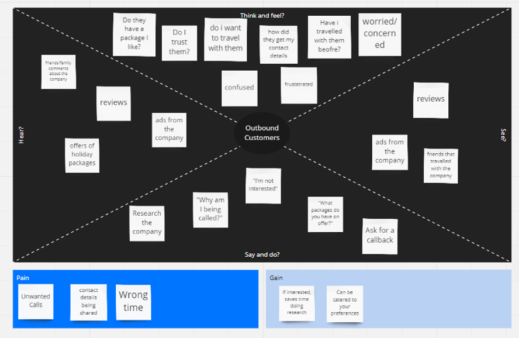

# Design Thinking Approach

In our design thinking approach, we started developing two empathy maps, one for
inbound calls customers and one for outbound calls customers.

All three of the empathy maps (shown below) are provided with a Pain and Gain section so we can have a clear view of the situation, and the outbound call empathy maps have a small section as well with assumption. This empathy phase helped us to gather important insights that will help us to solve the problem because we can easily define it. We created a section for the problem definition based on the feedback gathered from the previous artefacts, so we could define the objective.

Empathise has been the most powerful tool that we used to understand and define the problem, design thinking helped us with looping phases and gather the best information from it.

\pagebreak

## Relationship Manager Empathy Map

### User’s Perspective

I am a young working professional that is trying to assist customers with planning a holiday in the most efficient way possible. I specialize in Asian based holiday packages, so I struggle when I am inaccurately matched with a customer. This makes me feel frustrated as I need to pass the customer on to a different colleague and makes it harder to meet my call requirements for the day.

### User Researcher’s Perspective

Busy working professionals requiring a more efficient and accurate profiling and call routing system that allows customers to connect to Relationship Managers with appropriate skills and product knowledge. The system should profile customers and relationship managers and route calls according to the profiles.

### Who, What, When, Where Perspective

Our young, busy professionals struggle with inaccurate matches with customers for their skill set and product knowledge. Our solution is to implement a new and improved system that has a more accurate profiling tool and an efficient, easy-to-use call routing tool.

\pagebreak

## Inbound Customer's Empathy Map

### User’s Perspective

As a customer, I am looking to book a holiday, but I don't really know what I'm looking for when booking a holiday. I am worried that I won't get the correct information I'm looking for when booking my holiday.

### User Researcher’s Perspective

Customers who are looking to book a holiday need someone who can assist and provide them with the correct information about the destination the customer wishes to travel to, as the customer may not have the knowledge or skills to do so by themselves.

### Who, What, When Where Perspective

Our customers struggle with booking the right holiday destination, as they may have little to no knowledge on their destination or booking holidays. Our solution is to match our customers to appropriate relationship managers that can provide the knowledge to our customers through an easy-to-use call routing system.

\pagebreak

## Outbound Customer's Empathy Map

### User’s Perspective

I am young working professional who is interested in travelling through a holiday package, however, I have not had the time to look into it. Receiving a call from a travel company at unexpected times or with unhelpful information can be confusing and irritating.

### User Researchers Perspective

Busy young professionals who could potentially benefit from a holiday package, however, has not had time to look into it and would be receiving calls from a travel company unaware of this incoming conversation. The new system aims to provide a better filtering system to contact potential customers at convenient times and with potential interest.

### Who, What, When, Where Perspective

Our busy, young professionals struggle with unexpected calls from the travel company hoping to peak potential interest in travel. Our solution is to improve the filtering system for the database of potential customers to allow the relationship managers to contact those that may have a higher interest or more convenient time for conversation.

\pagebreak
