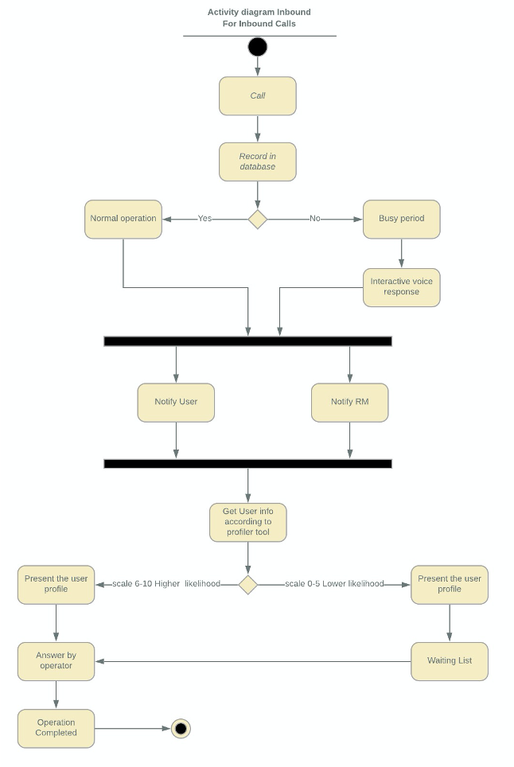
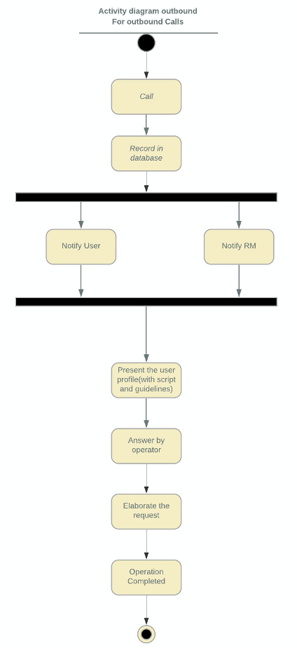
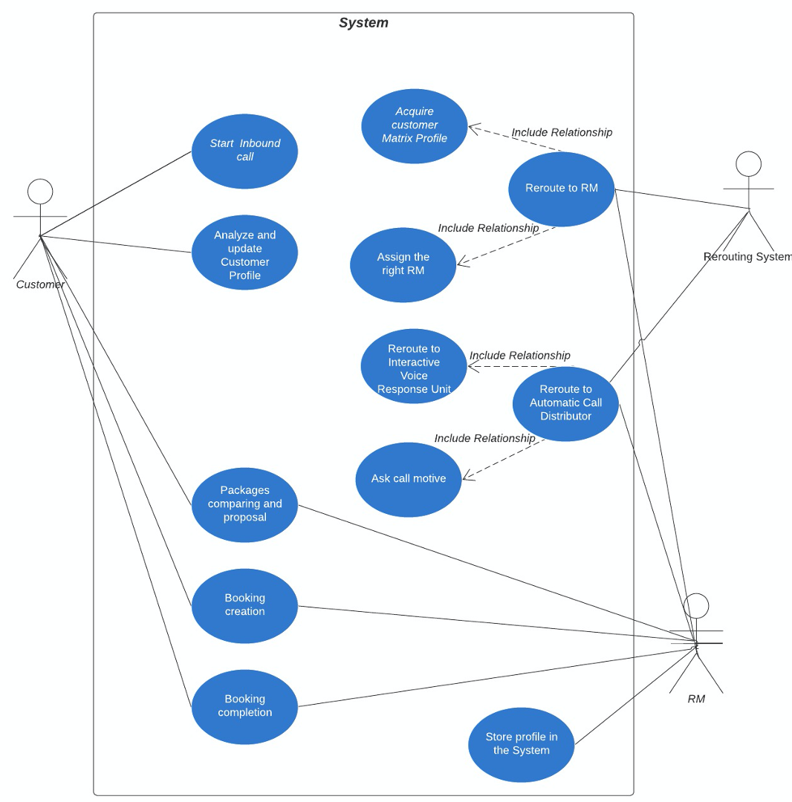
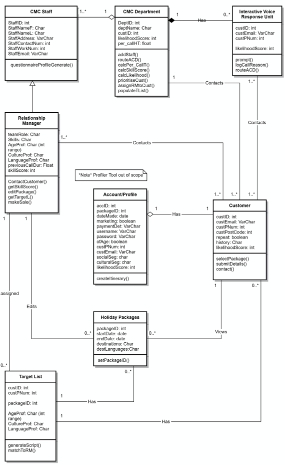
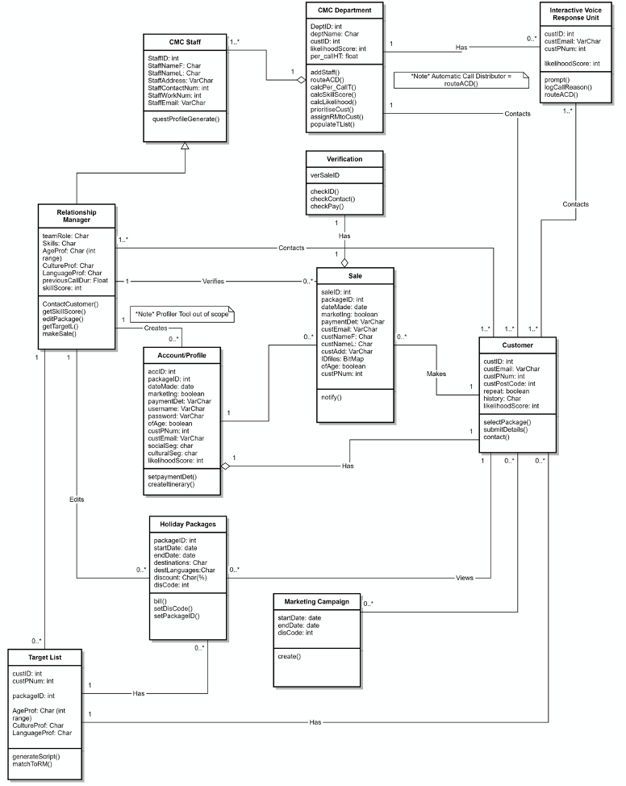
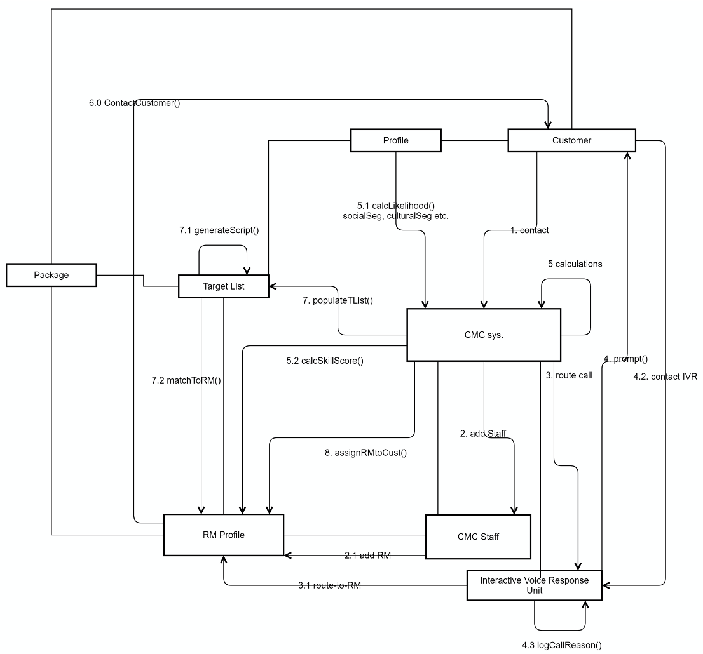
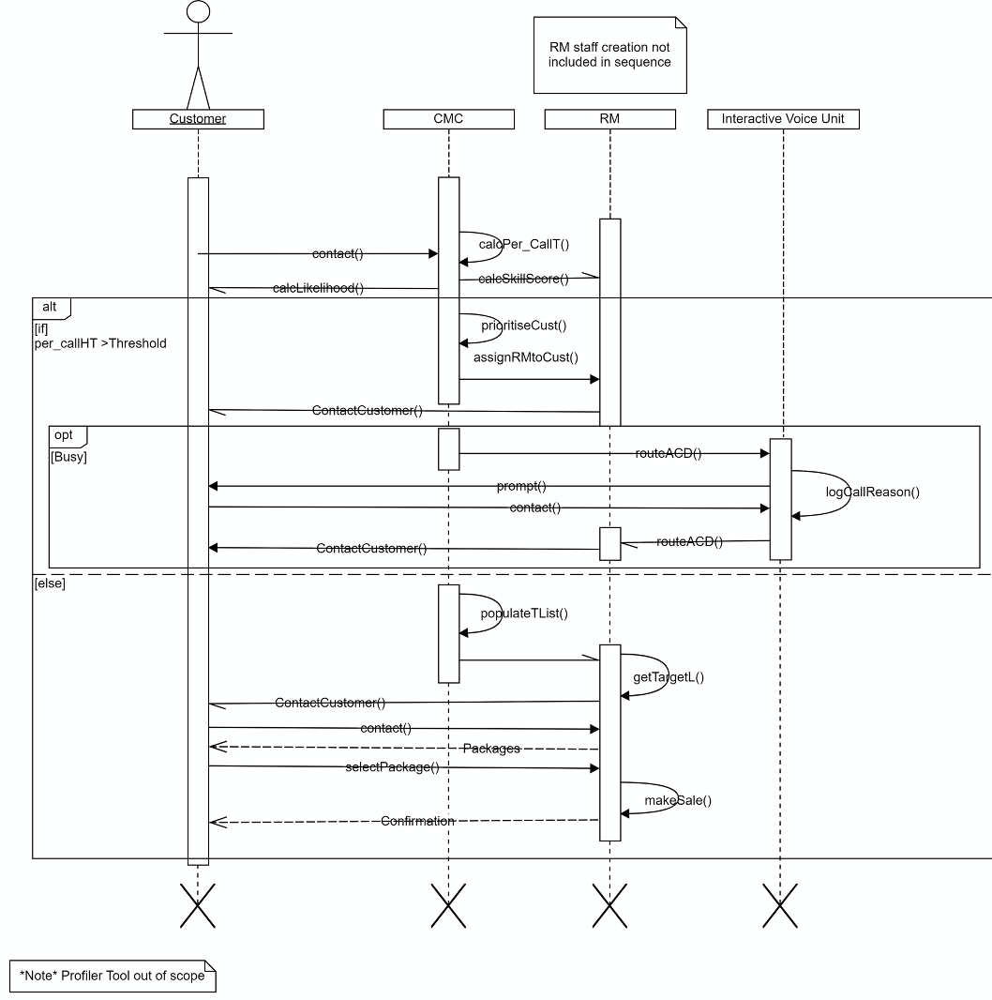

# Prototypes and Models

## Activity Diagrams

### Inbound Customers

\pagebreak

### Outbound Customers

\pagebreak

## Use Case Diagrams

### Inbound Customers

\pagebreak

### Outbound Customers

\pagebreak

## Class Diagrams

\pagebreak

## Sequence Diagram

\pagebreak
