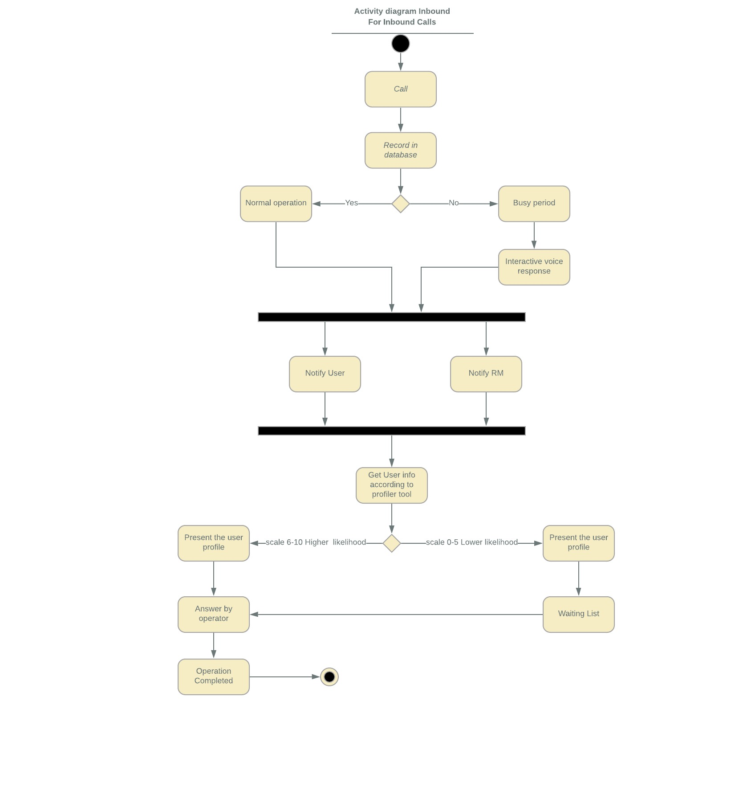
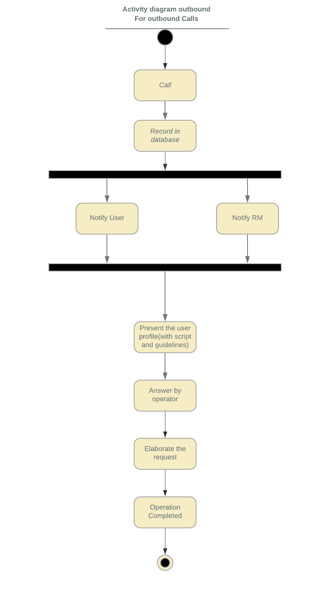
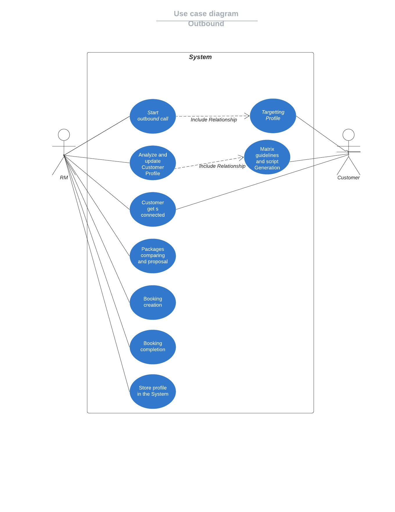
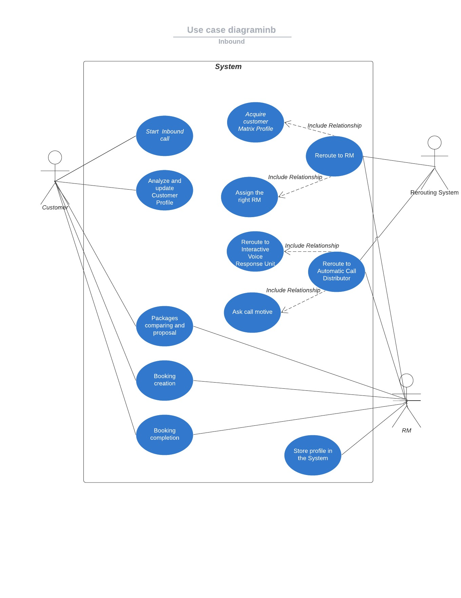
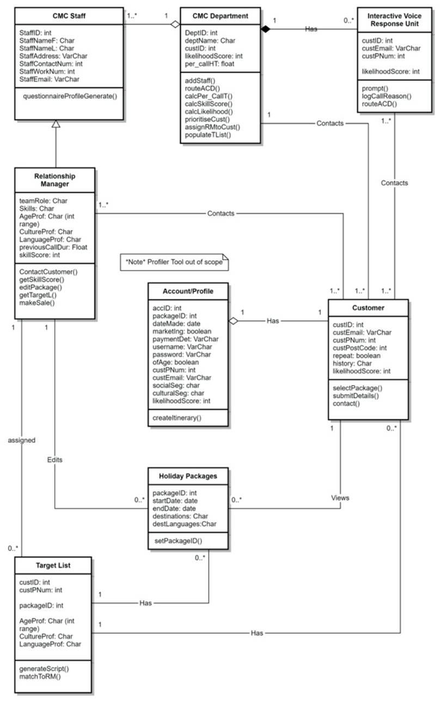
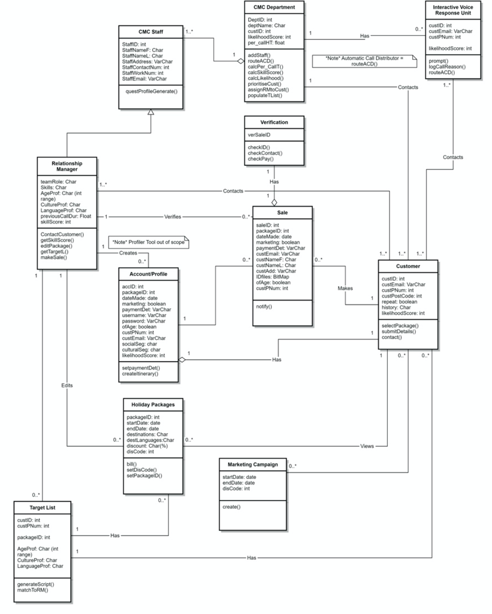
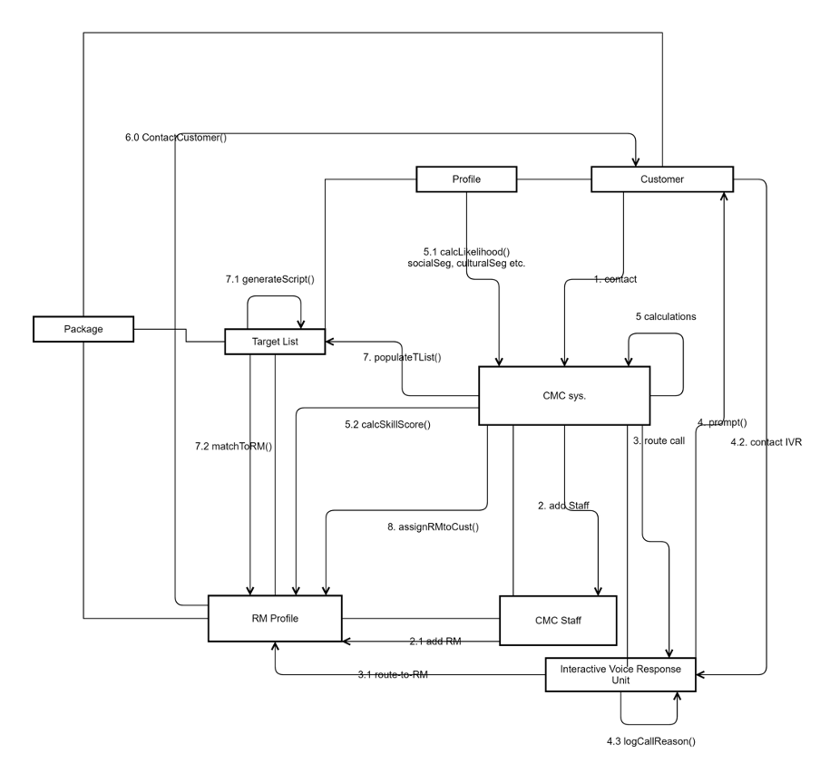
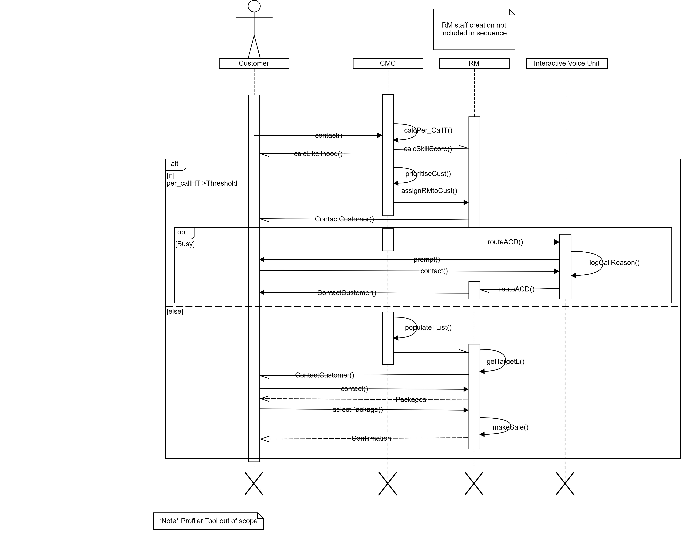

# Prototypes and Models

## Activity Diagrams

### Inbound Customers

\pagebreak

### Outbound Customers

\pagebreak

## Use Case Diagrams

### Inbound Customers

\pagebreak

### Outbound Customers

\pagebreak

### Class Diagram

\pagebreak

\pagebreak

The collaboration diagram focuses on the interaction and structure of objects in the system. A key emphasis was put on showing the visibility since it is important that there is a distinct limitation on what customers are able to interact with in the system due to security and privacy concerns.

\pagebreak

### Sequence Diagram

\pagebreak
